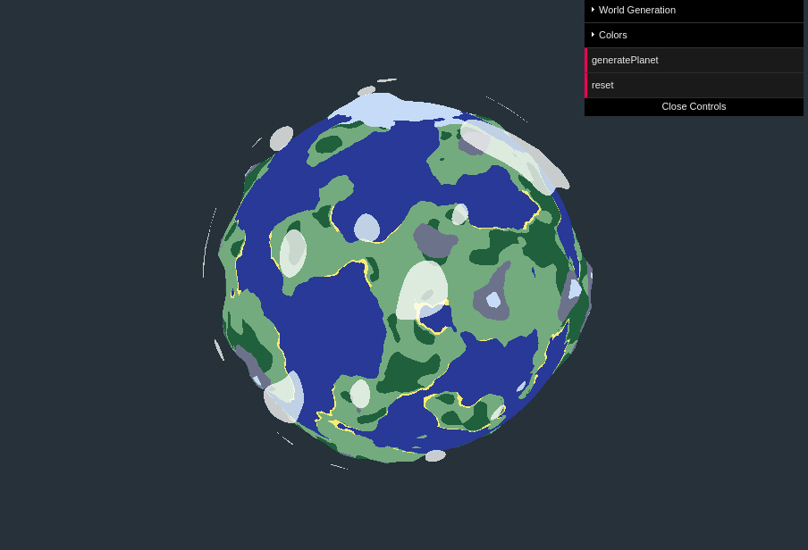

# Planet generation using ThreeJS and React

This repo is just some code I hacked together in a few days for fun. Hopefully someone will get some use or enjoyment out of it. The code is messy and could use a lot of refactoring, but I will leave it as is because of time constraints. Any PRs are more than welcome though.



The planets are generated almost exclusively inside shader code which works on a icosphere mesh. There's a bunch of parameters and colors that can be edited (some of which are exposed through the GUI).

After cloning the repo, install with 

```
npm install
```

and run on [http://localhost:3000](http://localhost:3000) with with 

```
npm start
```

## Authors

* **Thorsteinn Jonsson** - [@ThorsteinnJonsson](https://github.com/ThorsteinnJonsson)

## Acknowledgments

Icosphere generation was borrowed from [here](https://github.com/mourner/icomesh).